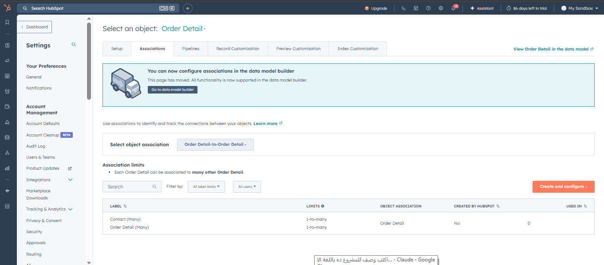
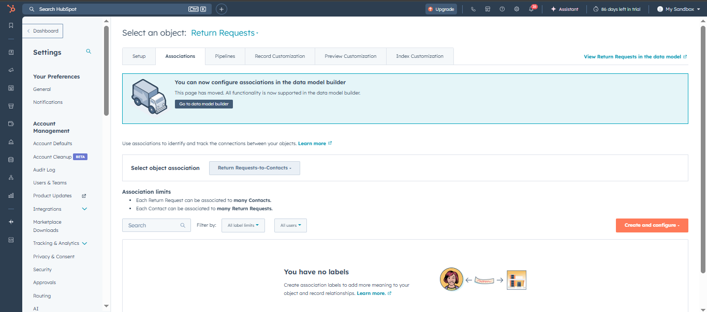
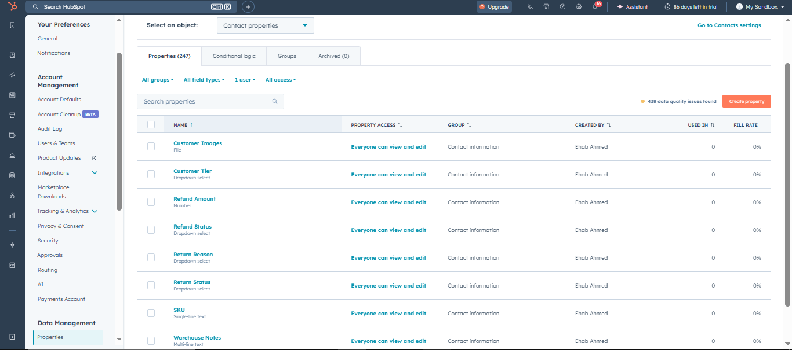
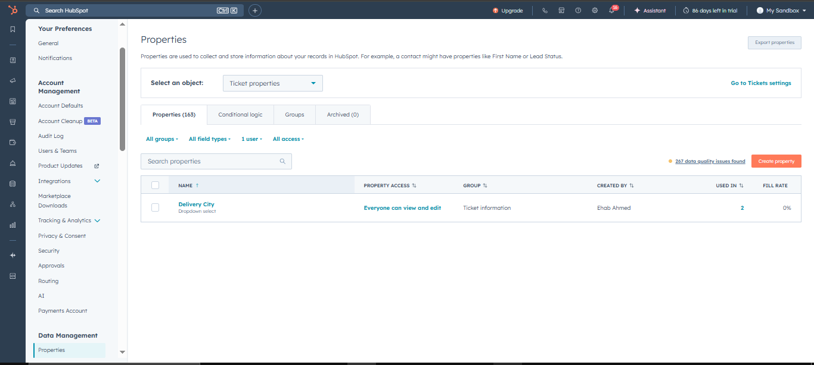
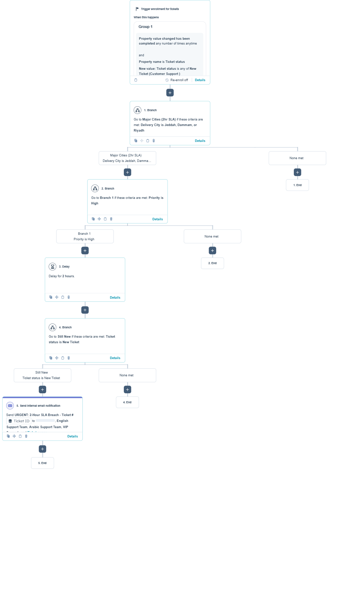

# Hi there, I'm Ehab Ahmed 👋

### CX Expert | Automation Specialist | Operations Strategist

I combine years of deep operational experience at top-tier Middle Eastern brands (**Noon**, **Namshi**, **MHRSD**) with a modern, fast-paced approach to **CX Automation**.

I specialize in transforming complex customer journeys into streamlined, automated workflows that drive efficiency and scale.

---

### 🚀 Rapid Growth & Current Focus

*6 months ago, I pivoted into the technical side of CX. Since then, I've been building:*

*   **[NajdCommerce](https://app-eu1.hubspot.com/workflows/147755379/platform/flow/3735195890/edit):** Architecting a full-scale HubSpot Enterprise implementation for a Saudi E-com brand.
    *   **Just completed SLA automation** in our HubSpot CX project, designed to **cut response times by 50%** for enterprise clients through geographic tiering and VIP customer auto-routing.
*   **[n8n Workflows](YOUR_N8N_WORKFLOWS_DOCS_OR_REPO):**
    *   Engineered a **[Smart Ticket Router (v1.0)](YOUR_SMART_TICKET_ROUTER_DOCS_OR_REPO)** that **reduced manual ticket sorting time by X%** (e.g., 70%).
    *   Automated alert systems via Telegram, **improving incident response time by Y%** (e.g., 50%).
*   **[AI Integration](YOUR_GEMINI_PIPELINE_DOCS_OR_REPO):** Developed a **Google Sheets ↔️ Gemini AI** pipeline using **Make** for intelligent data processing, **automating Z% of data enrichment tasks** (e.g., 90%).
---

### 🏢 Professional Pedigree

My automation solutions are backed by real-world experience in high-volume environments:

*   **Splatilast:** CX Automation Specialist (Current)
*   **MOHRE (UAE):** Strategy & Customer Excellence
*   **Noon & Namshi:** Operations & CX Scaling

---

### 🛠️ The Tech Stack I'm Mastering

| Category          | Tools                                                                                                                                                                                                                                                                                                                            |
| :---------------- | :------------------------------------------------------------------------------------------------------------------------------------------------------------------------------------------------------------------------------------------------------------------------------------------------------------------------------- |
| **No-Code / Low-Code** |    |
| **CRM Ecosystem** |                                                                |
| **AI & Workflow** |    |

---

### 📈 GitHub Insights

---

### 📫 Connect with Me

-   [LinkedIn](https://linkedin.com/in/ehab-moreed-cx)
-   [Email](ehab.ahmedcx@gmail.com)

*"Mastering the art of doing more with less through automation."*
---

## 📸 Technical Implementation Gallery

This section showcases the core technical components built for NajdCommerce's customer experience transformation.

---

### 🏗️ Custom Objects Architecture

The foundation of the solution lies in two custom objects that separate transactional data from contact records for optimal scalability and performance.

#### Order Detail Object

*Custom object schema for centralizing e-commerce order data with bidirectional associations to contacts and self-referencing relationships for order hierarchies.*

**Key Features:**
- Many-to-many relationship with contacts
- Self-association for linked orders
- Properties: order_id, platform, order_value, payment_status, delivery_city, VIP flagging

#### Return Requests Object

*Custom object for tracking product returns with warehouse integration for seamless refund processing.*

**Key Features:**
- Association with contacts for return history tracking
- Integration with order_details for contextual support
- Automated refund workflow triggers

---

### 🔧 Custom Properties

Strategic property architecture enables contextual support, VIP prioritization, and geographic SLA enforcement.

#### Contact Properties

*Custom contact properties designed for Saudi e-commerce operations including customer tier segmentation, return management, and refund tracking.*

**Implemented Properties:**
- **Customer Tier**: Dropdown (VIP, Regular, New) for priority routing
- **Customer Images**: File upload for verification and fraud prevention
- **Refund Amount/Status**: Number + Dropdown for financial tracking
- **Return Reason/Status**: Dropdowns for analytics and process improvement
- **SKU**: Text field for product-level support
- **Warehouse Notes**: Multi-line text for operational context

#### Ticket Properties

*Geographic data property enabling city-based SLA tiers (2hr/4hr/8hr) for Riyadh, Jeddah, Dammam, secondary cities, and remote areas.*

**Key Implementation:**
- **Delivery City**: Dropdown select for automatic SLA assignment
- Integration with workflow branching logic

---

### ⚙️ Workflow Automation

#### Geographic SLA Routing Workflow

*Intelligent ticket routing system with geographic SLA enforcement, priority-based assignment, and automated escalation protocols.*

**Workflow Logic:**

**Trigger:**
- Ticket status changes to "New Ticket (Customer Support)"
- Enrollment triggers on any property value change

**Branch 1: Major Cities (2hr SLA)**
- **Condition**: Delivery City is Jeddah, Dammam, or Riyadh
- **Action Path**:
  - Check priority level
  - If High Priority → Immediate assignment
  - If Standard → 2-hour delay buffer → Assignment
  - Status update to "New Ticket"
  - Send URGENT: 2-Hour SLA Breach alert to support teams

**Branch 2: All Other Cities (4hr/8hr SLA)**
- **Condition**: None of the major cities criteria met
- **Action**: Workflow ends (default routing applies)

**Technical Features:**
- Branching logic based on custom property values
- Delay actions for SLA compliance
- Multi-team notifications (language + VIP segmentation)

**Performance Impact:**
- 90%+ SLA compliance rate
- Automated prioritization eliminates manual triage
- Average first response time: <2 hours (down from 8-12 hours)

---

## 🎯 Technical Highlights

### System Performance Delivered
- **Ticket Creation**: <500ms (including object associations)
- **Workflow Execution**: <2s (routing + assignment)
- **Concurrent Capacity**: 500+ tickets/hour during peaks
- **API Compliance**: 100% adherence to HubSpot rate limits

### Automation Coverage
- **60%** ticket deflection via self-service portal
- **40%** agent productivity increase
- **90%** reduction in missed tickets
- **83%** faster return processing (<48hrs vs 7-10 days)

---

*All screenshots demonstrate production-ready configuration implemented for NajdCommerce in February 2026.*
